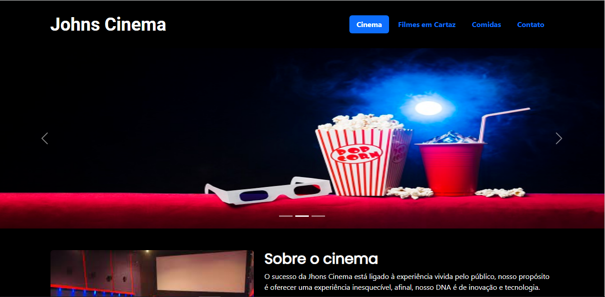
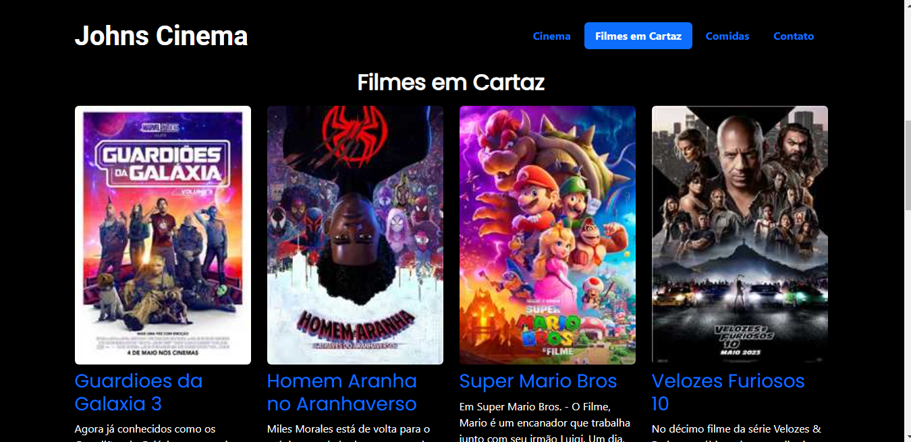
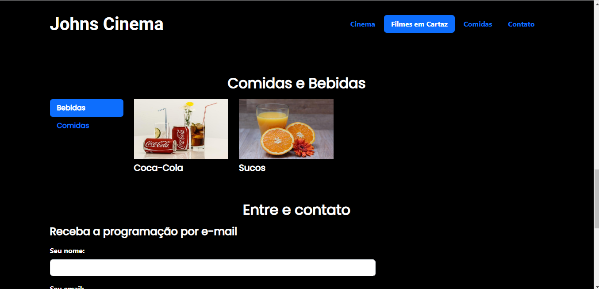
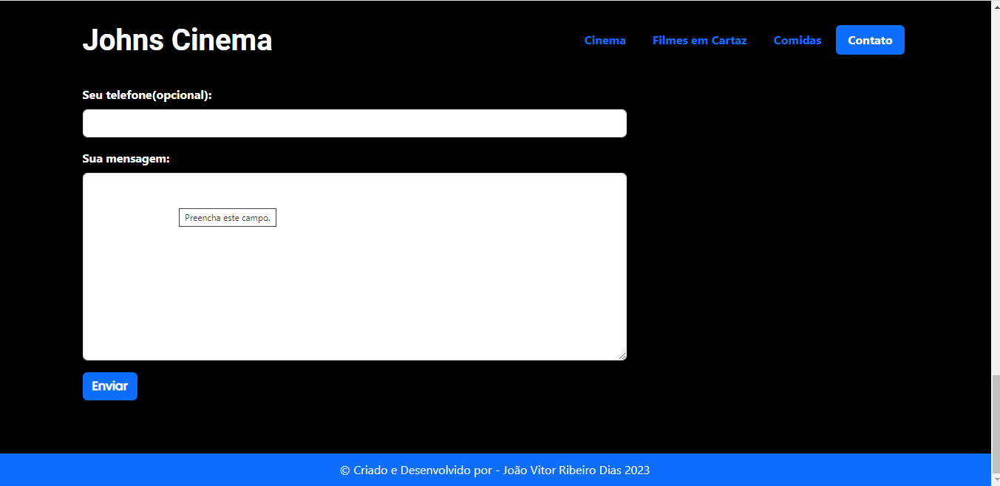

# 
Jhons cinema

</img>

 

# 🛠 Tecnologias utilizadas:
 

  

  
   
  
  

 

# 💻  Sobre o Projeto:
<li>Neste projeto eu desenvolvi uma página para um cinema chamado Jhons cinema.A ideia foi criar uma página atraente e envolvente, que transmita a personalidade única do cinema. Neste projeto fiz o uso do Bootstrap que é um front-end que fornece estruturas de CSS para a criação de sites e aplicações responsivas de forma rápida e simples. 
 
Link so site: https://cinema-bootstrap.vercel.app/</li>
 

# 🎨 Pré-visualização :
## Apresentação da Página:

   

   

   

# 🦸 Autor:

 
<a href="https://www.linkedin.com/in/jo%C3%A3o-vitor-ribeiro-dias-339a56258/" target="_blank">João Vitor RIbeiro Dias</a>
